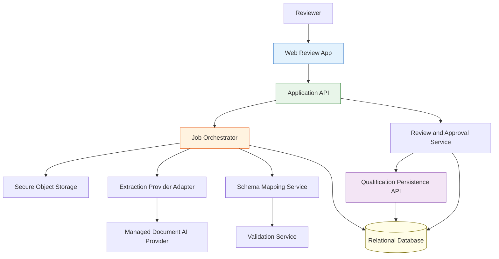
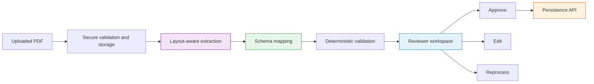

---
inputs:
  decision_id:
    description: "ADR sequential ID number"
    required: true
    default: "1"
  decision_title:
    description: "Short title of the architectural decision"
    required: true
    default: "Qualification PDF extraction platform architecture"
  issue_number:
    description: "Local issue number"
    required: true
    default: "1"
  epic_id:
    description: "Parent epic number"
    required: false
    default: "1"
  date:
    description: "Decision date"
    required: false
    default: "2026-03-16"
  status:
    description: "Decision status"
    required: false
    default: "Accepted"
  author:
    description: "Author of this architectural decision"
    required: false
    default: "Solution Architect Agent"
---

# ADR-1: Qualification PDF extraction platform architecture

**Status**: Accepted  
**Date**: 2026-03-16  
**Author**: Solution Architect Agent  
**Epic**: #1  
**Issue**: #1  
**PRD**: [PRD-1.md](../prd/PRD-1.md)

---

## Table of Contents

1. [Context](#context)
2. [Decision](#decision)
3. [Options Considered](#options-considered)
4. [Rationale](#rationale)
5. [Consequences](#consequences)
6. [Implementation](#implementation)
7. [AI and ML Architecture](#ai-and-ml-architecture)
8. [References](#references)
9. [Review History](#review-history)

---

## Context

The product must extract qualification structures from uploaded PDFs, display the extracted structure in a web application, support reviewer edits and reprocessing, and persist only approved structures through a newly created API and backing database. The target schema is defined in [QualStructure.md](c:\Piyush%20-%20Personal\GenAI\PearsonQual\QualStructure.md) and expanded in [PRD-1.md](../prd/PRD-1.md).

### Requirements
- Web application delivery surface.
- AI-assisted extraction for semistructured qualification PDFs.
- Human-in-the-loop review before persistence.
- Confidence displayed to reviewers, but never used for auto-approval.
- Reviewer correction by direct edit or guided reprocessing.
- API-only persistence, with no direct database insertion from UI or extraction path.
- One-day retention for uploaded PDFs and rejected extraction payloads.
- WCAG 2.2 AA review experience.
- Strong file upload security controls.

### Constraints
- No existing insertion API exists; phase 1 must create it.
- No existing database schema exists; phase 1 must create it.
- Qualification PDFs are assumed to be non-PII, but must still be handled securely.
- Qualification families with fixed layouts are unknown; architecture must work for generalized semistructured documents first.
- The workflow must remain auditable across upload, extraction, review, edit, reprocess, approval, and submission.

### AI-first assessment

**Confidence: HIGH**

This problem should use AI-assisted document understanding rather than a purely rule-based parser. Public product documentation for Azure Document Intelligence and Google Document AI both emphasize layout-aware extraction, table handling, document structure recognition, and structured output for semistructured documents. That aligns directly with qualification PDFs, which contain nested sections, units, groupings, and rule logic that are difficult to recover from plain OCR or regex alone.

At the same time, the architecture should not depend on a free-form generative agent in the approval path. The correct phase 1 posture is hybrid:
- AI or document understanding for extraction.
- Deterministic mapping and validation for schema alignment.
- Human review for approval.

This keeps extraction quality high while containing hallucination risk and preserving auditability.

### Technology landscape research

| Technology | Evidence | Architecture implication |
|-----------|----------|--------------------------|
| Managed document AI services | Azure Document Intelligence documents layout, table, key-value, custom neural, custom template, and custom classification capabilities. Google Document AI documents OCR, layout parsing, form parsing, custom extraction, classification, and structured document objects. | Managed layout-aware extraction is credible for phase 1 and preferable to plain OCR. |
| Open-source extraction stacks | Public issue history for Unstructured shows recurring dependency and runtime instability. Public issue history for Marker shows interactive runtime and environment instability. | Open-source extraction should not be the primary production path for phase 1. |
| Accessibility guidance | W3C recommends WCAG 2.2 as the current standard for web applications. | Review UI must be designed for AA-level accessibility. |
| File upload security guidance | OWASP identifies unrestricted file upload as a high-risk vulnerability, with metadata, content, execution, and storage risks. | Upload isolation, validation, malware scanning, and short-lived storage are mandatory. |

### Benchmark and performance evidence

No neutral, publicly accessible benchmark in this workspace provides a trustworthy winner across managed document AI providers for semistructured qualification PDFs. Because reliable benchmark evidence is incomplete, the architecture must:
- keep the extraction provider behind an adapter boundary,
- define a representative evaluation corpus,
- pin provider and model versions,
- and make provider substitution possible without redesigning the rest of the platform.

**Confidence: MEDIUM**

### Failure modes and anti-patterns identified

| Failure mode | Evidence | Architectural response |
|-------------|----------|------------------------|
| Mis-extraction of nested groups and rules | Semistructured documents require layout-aware understanding, not plain text-only parsing. | Use layout-aware extraction plus deterministic schema mapping and validation. |
| File upload abuse or malicious content | OWASP unrestricted upload guidance highlights high risk and common exploitation patterns. | Isolate storage, allow-list file types, scan content, enforce retention, and require authenticated access. |
| Provider quality drift | Model and provider outputs change over time. | Pin provider versions, evaluate against a fixed corpus, and track approval metrics. |
| Interactive runtime instability in self-hosted open-source tools | Public issue histories show dependency and runtime instability. | Avoid open-source-first extraction path for phase 1. |
| Over-trusting confidence scores | Product requirement states confidence is informational only. | Require human approval regardless of confidence value. |

### Security and long-term viability assessment

Managed document AI platforms from major cloud providers show stronger maturity, structured APIs, and clearer support paths than the researched open-source stacks for this use case. Open-source libraries remain useful for diagnostics and experimentation but should not sit on the critical production path in phase 1.

**Confidence: MEDIUM**

---

## Decision

We will build a web-based, asynchronous, human-in-the-loop extraction platform composed of:
- a browser-based review application,
- a RESTful application API,
- an extraction orchestration service,
- a provider-adapter boundary for managed layout-aware document AI,
- deterministic schema mapping and validation services,
- a relational system of record for approved qualification structures,
- isolated object storage for uploaded PDFs and extracted payload artifacts,
- and an auditable approval and submission workflow.

### Key architectural choices
- Use managed layout-aware document AI behind a provider adapter rather than a direct hard-coded vendor dependency.
- Use asynchronous extraction jobs instead of synchronous request-response processing for the full workflow.
- Use a relational database as the system of record because qualifications, units, grade schemes, groups, and rulesets are highly relational.
- Use a dedicated persistence API boundary between review workflow and database writes.
- Keep confidence informational only and require explicit reviewer approval.
- Support both direct edit and guided reprocessing before approval.

### Reference architecture

---

## Options Considered

### Option 1: Managed document AI plus deterministic mapping plus human review

**Description**  
Use a managed, layout-aware document understanding provider through an adapter. Map the extracted layout entities into the qualification schema, validate them deterministically, then require reviewer approval before API submission.

**Pros**
- Strong fit for semistructured documents according to Azure and Google product documentation.
- Supports future provider substitution because the rest of the platform depends on the adapter contract, not a single provider.
- Keeps high-risk persistence decisions behind deterministic validation and human review.

**Cons**
- Introduces external provider cost and service dependency.
- Requires evaluation discipline because vendor-neutral benchmark data is incomplete.
- Needs explicit adapter design to avoid vendor leakage.

**Effort**: L  
**Risk**: Medium

### Option 2: Open-source extraction stack plus self-hosted OCR and layout pipeline

**Description**  
Use an open-source pipeline for OCR, layout parsing, and extraction, with self-hosted orchestration and custom mapping.

**Pros**
- High control over runtime and deployment.
- Lower direct provider fees if operational overhead is ignored.
- Potentially easier future custom tuning.

**Cons**
- Public issue history shows dependency and runtime instability for researched tools.
- Higher operational burden for reliability, scaling, and maintenance.
- Slower path to production-grade quality for semistructured qualification PDFs.

**Effort**: XL  
**Risk**: High

### Option 3: Plain OCR and rule-based parsing only

**Description**  
Use OCR or PDF text extraction and parse document content with rules, patterns, and section heuristics only.

**Pros**
- Lowest dependency footprint.
- Deterministic and easier to explain locally.
- Potentially sufficient for a narrow, fixed-layout corpus.

**Cons**
- Weak fit for semistructured documents with layout-driven meaning.
- Fragile in the face of unknown qualification family variations.
- High manual rule maintenance cost over time.

**Effort**: M  
**Risk**: High

---

## Rationale

We chose **Option 1** because it best satisfies the PRD requirements while containing operational and quality risk.

1. **Semistructured document fit**: Managed layout-aware extraction directly matches the document characteristics described in the PRD and supported by researched provider documentation.  
   **Confidence: HIGH**

2. **Controlled persistence**: The workflow can be AI-assisted without being AI-trusting. Deterministic validation and reviewer approval sit between extraction and persistence.  
   **Confidence: HIGH**

3. **Relational persistence fit**: The qualification domain is centered on stable entity relationships such as one-to-many and many-to-many links across qualifications, units, groups, rule sets, and grade schemes. A relational model is the simplest defensible system of record.  
   **Confidence: HIGH**

4. **Operational resilience**: Research signals suggest avoiding a production-first dependence on unstable open-source extraction stacks. The adapter approach keeps the door open for future substitution without taking that risk now.  
   **Confidence: MEDIUM**

5. **Web review workflow fit**: The product is explicitly a web application with human confirmation, so an asynchronous architecture with job tracking, review workspaces, and explicit submission states is a better fit than a synchronous ingestion API.  
   **Confidence: HIGH**

### Key decision factors
- Extraction quality for semistructured documents
- Auditability and approval safety
- Time to production readiness
- Long-term maintainability
- Provider substitution flexibility
- Security posture for file uploads

---

## Consequences

### Positive
- Higher probability of accurate phase 1 extraction for semistructured qualification PDFs.
- Clear separation between extraction, review, and persistence responsibilities.
- Strong audit posture across the workflow.
- Relational storage aligns naturally with the qualification model.
- Provider adapter keeps future commercial leverage and migration options open.

### Negative
- Initial architecture is more complex than a simple upload-and-parse service.
- External provider cost and service availability become platform concerns.
- Provider evaluation and regression testing become mandatory operating disciplines.
- Reviewer workflow design becomes a first-class success factor, not a secondary UI concern.

### Neutral
- The system requires both transient artifact storage and persistent relational storage.
- Confidence values remain advisory and do not reduce the need for review.
- Qualification-family specializations are postponed until patterns are observed in production.

---

## Implementation

**Detailed technical specification**: [SPEC-1.md](../specs/SPEC-1.md)

### High-level implementation plan
1. Define the relational schema and persistence API contract for the qualification model.
2. Build the asynchronous ingestion, extraction, mapping, and validation pipeline.
3. Build the web review workspace with hierarchy visualization, source linkage, edit, reprocess, and approval flows.
4. Add audit, retention, monitoring, and provider evaluation controls.

### Key milestones
- Phase 1: Persistence schema and API contract complete.
- Phase 2: Extraction orchestration and schema mapping complete.
- Phase 3: Review web application and approval flow complete.
- Phase 4: Pilot evaluation, provider tuning, and operational hardening complete.

---

## AI and ML Architecture

### Model selection decision

| Option | Capability fit | Operational maturity | Lock-in risk | Selected |
|-------|----------------|----------------------|-------------|----------|
| Managed layout-aware document AI through adapter | High | Medium to High | Medium | PASS |
| Open-source self-hosted extraction stack | Medium | Low to Medium | Low | FAIL |
| Plain OCR and rules only | Low | High | Low | FAIL |

### Agent architecture pattern
- Single extraction pipeline with deterministic post-processing
- Human-in-the-loop review and approval
- Hybrid architecture with AI-assisted extraction and deterministic validation

### Inference pipeline

### Evaluation strategy

| Metric | Evaluator | Threshold | How measured |
|-------|-----------|-----------|--------------|
| Schema completeness | Human-verified corpus comparison | 95 percent for required fields | Corpus-based scoring |
| First-pass approval rate | Review workflow analytics | 85 percent | Pilot approval metrics |
| End-to-end extraction start latency | Platform telemetry | Within PRD target | P50 and P95 timings |
| Persistence success after approval | API telemetry | 99 percent | Submission outcome tracking |

### AI-specific risks

| Risk | Impact | Mitigation |
|------|--------|------------|
| Layout model misses nested rule logic | High | Deterministic validation and reviewer gating |
| Provider output drift | Medium | Version pinning, evaluation corpus, release gate |
| Confidence misinterpreted as correctness | Medium | Advisory-only confidence labels and approval gate |
| Provider outage | Medium | Retries, job state retention, adapter boundary for substitution |

---

## References

- [PRD-1.md](../prd/PRD-1.md)
- Azure Document Intelligence overview
- Google Document AI overview
- OWASP unrestricted file upload guidance
- W3C WCAG 2.2 guidance
- Public issue history for Unstructured and Marker reviewed during research

---

## Review History

| Date | Reviewer | Outcome | Notes |
|------|----------|---------|------|
| 2026-03-16 | Solution Architect Agent | Accepted | Initial architecture decision based on PRD and external research |