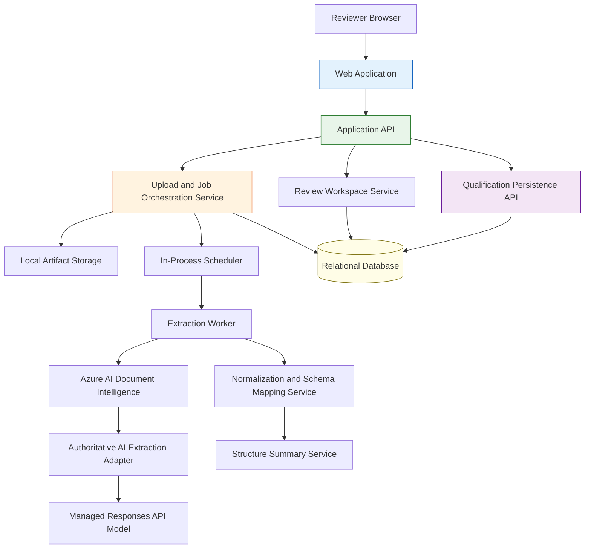
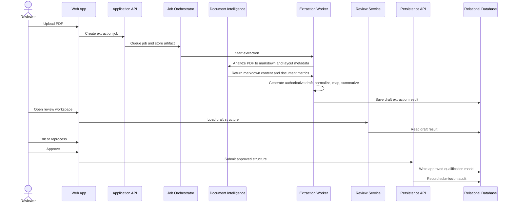
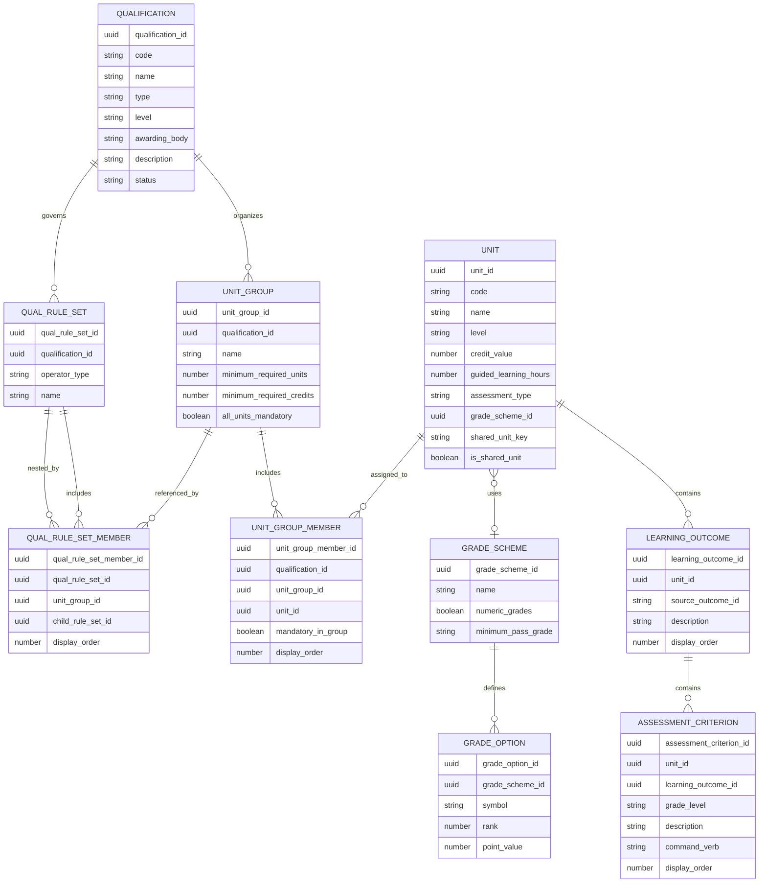
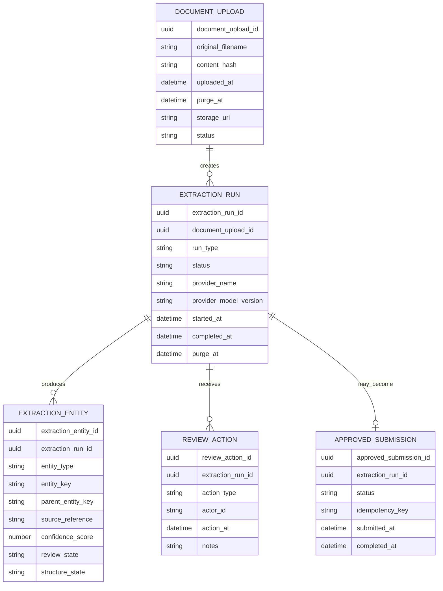
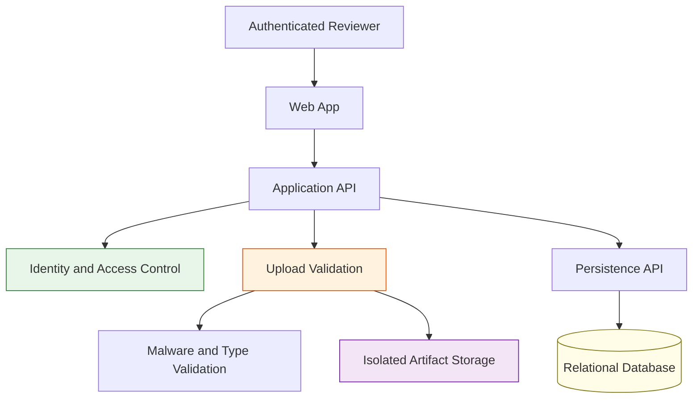
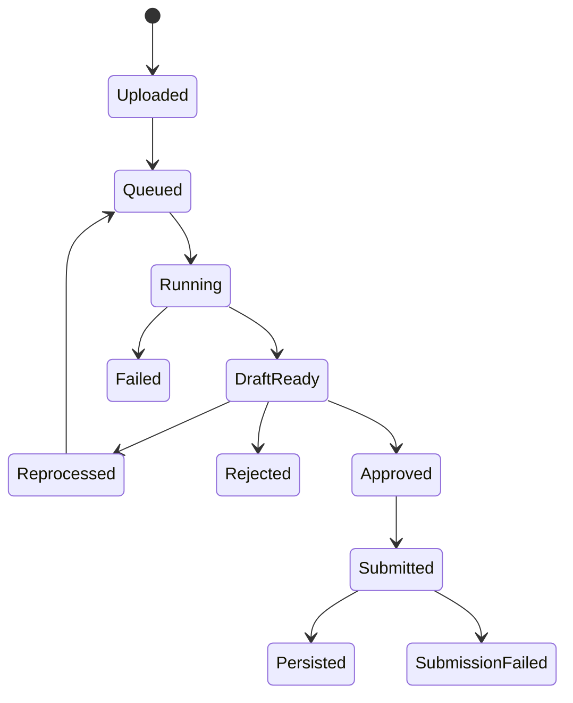

---
inputs:
  feature_name:
    description: "Name of the feature being specified"
    required: true
    default: "Qualification PDF extraction platform"
  issue_number:
    description: "Local issue number"
    required: true
    default: "1"
  epic_id:
    description: "Parent epic number"
    required: false
    default: "1"
  author:
    description: "Spec author"
    required: false
    default: "Solution Architect Agent"
  date:
    description: "Specification date"
    required: false
    default: "2026-03-16"
---

# Technical Specification: Qualification PDF extraction platform

**Issue**: #1  
**Epic**: #1  
**Status**: Accepted  
**Author**: Solution Architect Agent  
**Date**: 2026-03-22  
**Related ADR**: [ADR-1.md](../adr/ADR-1.md)  
**Related PRD**: [PRD-1.md](../prd/PRD-1.md)

---

## Table of Contents

1. [Overview](#1-overview)
2. [Goals and Non-Goals](#2-goals-and-non-goals)
3. [Architecture](#3-architecture)
4. [Technology Stack](#4-technology-stack)
5. [Component Design](#5-component-design)
6. [Data Model](#6-data-model)
7. [API Design](#7-api-design)
8. [Security](#8-security)
9. [Performance](#9-performance)
10. [Error Handling](#10-error-handling)
11. [Monitoring](#11-monitoring)
12. [Testing Strategy](#12-testing-strategy)
13. [Migration Plan](#13-migration-plan)
14. [Open Questions](#14-open-questions)

---

## 1. Overview

This specification defines the architecture for a web application that ingests qualification PDFs, extracts qualification structure with AI-assisted document understanding, lets reviewers inspect and correct the result, and persists reviewer-confirmed structures through a dedicated API into a relational database. The updated product contract requires the platform to support multiple qualifications in one source document, shared units reused across qualifications, learning outcomes and assessment criteria linked to units, discovered-qualification summaries, and structure-first review before persistence.

The design prioritizes four things:
- extraction quality for semistructured documents,
- review safety before persistence,
- relational integrity for qualification structures, including shared units and nested assessment entities,
- and operational controls for uploads, retention, and audit.

The current Azure deployment model also needs to support side-by-side internal environments. `dev` and `staging` must be independently deployable and independently testable without sharing runtime state.

**Confidence: HIGH**

---

## 2. Goals and Non-Goals

### Goals
- Support the qualification model defined in [QualStructure.md](../../../QualStructure.md).
- Deliver a browser-based review workspace.
- Separate extraction from persistence through an approval gate.
- Support both reviewer edit and reprocess workflows.
- Support documents containing more than one qualification.
- Preserve shared-unit identity across multiple qualifications.
- Persist learning outcomes, assessment criteria, and command verbs or grade descriptors when present.
- Summarize discovered qualifications, shared units, units, outcomes, and criteria for reviewers.
- Support expandable and collapsible hierarchy navigation for nested groups.
- Persist approved structures through a dedicated API and relational database.
- Enforce one-day retention for uploaded PDFs and rejected extraction payloads.

### Non-Goals
- Direct database insertion from the UI.
- Full document authoring or publication workflows.
- Family-specific extraction tuning in phase 1 unless strong pilot evidence emerges.
- Fully autonomous persistence without human review.

---

## 3. Architecture

### 3.1 Current runtime architecture

### 3.2 Architectural style

| Concern | Choice | Reason |
|--------|--------|--------|
| User interaction | Web application | Product requirement |
| Extraction execution | Asynchronous in-process jobs | PDFs vary in size and processing time, and the current runtime uses `setTimeout` scheduling plus startup rescan |
| Persistence | REST API plus relational database | Strong domain relationships and approval boundary |
| Extraction provider | Azure AI Document Intelligence plus a Responses API adapter | Layout-aware extraction is separated from authoritative structured generation |
| Review gating | Human-in-the-loop structure review | Product requirement and risk containment |
| Environment topology | Separate `dev` and `staging` deployments | The current MVP uses local uploads, SQLite, and in-process jobs, so side-by-side validation requires isolated app instances |

### 3.2.1 Environment topology

| Environment | Purpose | Isolation boundary | Notes |
|------------|---------|--------------------|-------|
| `dev` | Current live internal environment | Separate App Service and AI resources | Used for the existing live version |
| `staging` | Side-by-side validation environment | Separate App Service and AI resources | Used to validate new changes before replacing `dev` |
| `prod` | Future hardened environment | Separate App Service and AI resources | Not yet appropriate for external production exposure |

Each environment is isolated at the Azure resource level. Because the current MVP uses app-local SQLite and upload storage, uploads, jobs, and approved history do not flow across environments.

### 3.3 Primary workflow

### 3.4 Practical Node plus Foundry target architecture

| Layer | Recommended near-term shape | Notes |
|------|------------------------------|-------|
| Browser app | Keep current web review application | No architectural change required in the reviewer experience |
| Application API | Keep Node.js API as the system entrypoint | Continues to own upload, job state, review, approval, and persistence orchestration |
| Extraction worker | Keep extraction orchestration in Node.js | Existing `server/extractionService.js` remains the workflow boundary |
| Document analysis | Keep Azure AI Document Intelligence as the first extraction stage | The worker sends the stored PDF artifact to `prebuilt-layout` and uses markdown output plus document metrics |
| AI provider | Use an OpenAI-compatible provider adapter that can call Azure AI Foundry or OpenAI Responses API endpoints | The worker sends Document Intelligence markdown and workflow context to the configured model |
| Prompt and schema assets | Keep prompt markdown and JSON schema assets in the repo | The external authoritative schema remains version-controlled separately from the internal normalized review contract |
| Compatibility boundary | Keep deterministic normalization in `server/aiDraftNormalizer.js` | The review workspace continues to consume the internal graph even though the model returns the authoritative contract |
| Observability | Keep the current OpenTelemetry tracer provider and add an exporter when central telemetry is required | App Insights exists in Azure, but the current runtime does not yet export traces there |
| Evaluation | Add Foundry evaluation runs before model changes | Use schema compliance, completeness, and quality thresholds before promotion |

This target keeps the current application architecture intact while moving model hosting, model versioning, evaluation, and operational governance into Azure AI Foundry. It avoids a second AI runtime until the extraction pipeline requires multi-step agent orchestration.

**Confidence: HIGH**

---

## 4. Technology Stack

### 4.1 Current implementation stack

| Layer | Current stack | Notes |
|------|---------------|-------|
| Frontend | HTML, CSS, vanilla JavaScript | Static browser app served directly from the local server |
| Backend runtime | Node.js | CommonJS modules with a lightweight built-in HTTP server |
| HTTP layer | `node:http` | No Express or full backend framework is currently used |
| Database | SQLite via `node:sqlite` | Local relational persistence for jobs, drafts, and approved qualification data |
| File storage | Local filesystem | Uploaded PDFs are retained under `QUAL_UPLOADS_DIR` or `server/uploads` for one day |
| Document analysis | Azure AI Document Intelligence `prebuilt-layout` | Produces markdown content plus page and structure metrics for the AI step |
| AI extraction | Provider adapter over the OpenAI-compatible SDK Responses API | Sends Document Intelligence markdown and workflow context to the configured model and enforces a strict authoritative JSON schema |
| AI prompt contract | Authoritative prompt plus authoritative structured-output schema, then normalized internal review graph | The uploaded PDF remains the source artifact, but the current model input is Document Intelligence markdown rather than direct file attachment |
| Observability | OpenTelemetry API and Node tracer provider | Current tracing is local-process only; no Application Insights exporter is wired yet |
| Testing | Node built-in test runner | Covers workflow state, Document Intelligence mediated AI extraction, pending drafts, and normalized persistence |

### 4.1.1 Current Azure environment shape

| Resource type | `dev` shape | `staging` shape |
|--------------|-------------|-----------------|
| App Service plan | Dedicated per environment | Dedicated per environment |
| Web app | Dedicated per environment | Dedicated per environment |
| Key Vault | Dedicated per environment | Dedicated per environment |
| Application Insights | Dedicated per environment | Dedicated per environment |
| Azure OpenAI account | Dedicated per environment | Dedicated per environment |
| Document Intelligence account | Dedicated per environment | Dedicated per environment |

This duplication is intentional. With the current MVP architecture, sharing those runtime resources would blur environment boundaries and complicate side-by-side validation.

### 4.2 Current implementation artifacts

| Concern | Artifact |
|--------|----------|
| App entrypoint | `server.js` |
| Browser application | `app/` |
| Workflow and persistence facade | `server/jobStore.js` |
| Relational schema and queries | `server/databaseStore.js` |
| Extraction orchestration | `server/extractionService.js` |
| AI client integration | `server/aiClient.js` |
| Document analysis integration | `server/documentIntelligenceClient.js` |
| AI draft normalizer | `server/aiDraftNormalizer.js` |
| Artifact retention and lookup | `server/uploadStore.js` |
| Prompt definition | `prompts/qualification-extractor.md` |
| Authoritative structured output schema | `templates/qualification-extraction-authoritative-schema.json` |
| Internal normalized review contract reference | `templates/qualification-extraction-schema.json` |

### 4.3 Target production posture

| Concern | Current posture | Production direction |
|--------|-----------------|----------------------|
| Frontend | Vanilla browser app | Can remain lightweight or move to a richer SPA only if workflow complexity justifies it |
| API server | Single Node process | Multi-instance deployment behind a managed ingress |
| Database | Local SQLite | Managed relational database |
| File storage | Local filesystem | Managed object storage with signed access and lifecycle rules |
| Job orchestration | In-process scheduling | Queue-backed worker model |
| AI provider | Single OpenAI-compatible path | Provider adapter model with Azure AI Foundry as the primary managed inference and evaluation backend |
| Observability | Local tracing only | Centralized logs, metrics, and distributed tracing |

Until the database and upload store move to managed shared services, every Azure environment must remain single-instance and independently stateful.

### 4.4 Stack rationale

| Decision | Reason |
|---------|--------|
| Node.js end to end | Keeps the local implementation simple and fast to iterate |
| SQLite first | Gives relational integrity without external infrastructure |
| File-based prompt and schema assets | Keeps AI behavior reviewable and version-controlled |
| Vanilla frontend | Avoids framework overhead while the workflow is still being shaped |
| Document Intelligence plus OpenAI-compatible Responses API | Separates layout recovery from authoritative structure generation and matches the current production code path |

### 4.5 Recommended Azure transition path

| Concern | Recommended path now | Deferred until needed |
|--------|-----------------------|-----------------------|
| Model hosting | Azure AI Foundry managed model deployment | Custom container or separate AI runtime |
| AI integration style | Node.js provider adapter that calls Foundry | Microsoft Agent Framework-based workflow service |
| Prompting | Existing repo prompt plus JSON schema contract | Planner-based or multi-agent prompt sets |
| Evaluation | Foundry evals plus repo regression fixtures | Full autonomous optimization loop |
| Telemetry | OpenTelemetry exported to Application Insights | Cross-service distributed traces across multiple AI workers |
| Workflow complexity | Document Intelligence analysis followed by a single structured extraction call | Multi-step agent workflow with tool orchestration |

The recommended next step is therefore Node.js plus Azure AI Foundry, not Node.js plus MAF. MAF becomes justified only if extraction evolves into a separate AI workflow service with tool-calling, reflection, or multi-stage review and refinement loops.

**Confidence: HIGH**

---

## 5. Component Design

### 5.1 Web Application

| Component | Responsibility |
|----------|----------------|
| Upload workspace | Accept PDF uploads, show job state, enforce client-side constraints |
| Review hierarchy panel | Render document, qualifications, groups, shared units, learning outcomes, assessment criteria, grading, and rules as a hierarchy |
| Detail panel | Render selected entity fields, confidence, source references, structure context, and shared-unit reuse context |
| Edit workspace | Allow supported field corrections before approval |
| Reprocess controls | Let reviewer submit adjusted extraction guidance |
| Approval panel | Approve, reject, or defer an extraction result once the reviewer has confirmed the structure |

### 5.2 Application API

| Component | Responsibility |
|----------|----------------|
| Session and authorization boundary | Authenticate users and authorize workflow actions |
| Upload API | Accept upload metadata and create extraction jobs |
| Review API | Load draft results, edits, structure summaries, and source references |
| Reprocess API | Create a new extraction attempt linked to the same document lineage |
| Approval API | Freeze approved payload and hand off to persistence API |

### 5.3 Extraction Orchestration Service

| Capability | Responsibility |
|-----------|----------------|
| Job state management | Track queued, running, completed, failed, rejected, and approved states |
| Artifact lifecycle | Store uploads and transient extracted artifacts with retention policy |
| In-process dispatch | Decouple user upload from extraction execution through scheduled background work in the current single-process runtime |
| Retry coordination | Retry transient failures safely |
| Metadata enrichment | Derive page count, source excerpt, and document structure metrics from Document Intelligence output without producing a heuristic qualification draft |

Environment note: the orchestration service is scoped to a single deployment instance. Jobs created in `staging` are not visible in `dev`, and vice versa.

### 5.4 Extraction Worker

| Stage | Responsibility |
|------|----------------|
| Provider invocation | Call Azure AI Document Intelligence with the stored PDF artifact, then call the configured Responses API endpoint with the resulting markdown and workflow context |
| Authoritative contract validation | Parse and validate the model response against the authoritative `Qualifications` schema |
| Normalization | Convert authoritative provider output into the internal review graph through `server/aiDraftNormalizer.js` |
| Schema mapping | Map normalized elements to qualifications, shared units, outcomes, criteria, and rule entities |
| Structure summarization | Derive discovered-qualification counts, shared-unit reuse summaries, and reviewer-facing structure metadata |
| Draft persistence | Save extraction attempt as a draft reviewable result, or a pending review draft with `aiError` if the PDF artifact or AI path is unavailable |

### 5.5 Review Service

| Capability | Responsibility |
|-----------|----------------|
| Draft retrieval | Load latest draft and extraction lineage |
| Source linking | Resolve page and section references for selected nodes |
| Change tracking | Track edits made by reviewers |
| Shared-unit projection | Show where one unit is reused across multiple qualifications or groups |
| Structure summary | Return discovered qualification counts, nested entity counts, and current approval availability |
| Reprocess lineage | Preserve attempt history across reruns |
| Approval packaging | Produce immutable approved submission payload |

### 5.6 Qualification Persistence API

| Capability | Responsibility |
|-----------|----------------|
| Contract validation | Validate approved payload shape, referential integrity, and multi-qualification shared-unit semantics |
| Persistence orchestration | Write qualification graph transactionally |
| Idempotency enforcement | Prevent duplicate writes for repeated approval submissions |
| Audit recording | Record submission event and outcome |

---

## 6. Data Model

### 6.1 Domain model

### 6.2 Workflow and audit entities

### 6.3 Retention policy

| Artifact | Retention |
|---------|-----------|
| Uploaded PDF | 1 day |
| Rejected extraction payload | 1 day |
| Draft extraction metadata | Retained for operational trace until governed otherwise |
| Approved submission audit | Retained as system audit record |
| Approved qualification data | Retained as system of record |

Retention is enforced per environment. There is no shared retention store across `dev` and `staging` in the current MVP.

**Confidence: MEDIUM**  
The PRD explicitly sets one-day retention for uploaded PDFs and rejected payloads. Approved audit retention is kept longer because without it the approval trail becomes non-durable.

---

## 7. API Design

### 7.1 API families

| API family | Purpose |
|-----------|---------|
| Upload API | Start extraction workflow |
| Review API | Load draft result, source references, edits, and structure summaries |
| Reprocess API | Create adjusted reruns |
| Approval API | Approve or reject review result |
| Qualification Persistence API | Persist approved qualification graph |

### 7.2 Resource model

| Resource | Description |
|---------|-------------|
| Upload | A submitted PDF and its storage metadata |
| Extraction Run | One processing attempt over an upload |
| Extraction Entity | One extracted reviewable entity with confidence and source link |
| Review Action | Reviewer edit, rejection, approval, or reprocess action |
| Submission | Immutable approved payload sent to persistence API |
| Qualification | Persistent system-of-record entity |
| Shared Unit | Reusable unit entity referenced by one or more qualifications |
| Structure Summary | Reviewer-facing counts and readiness metadata tied to a draft or submission |

### 7.3 Endpoint contract summary

| Method | Endpoint | Purpose | Request content | Response content |
|-------|----------|---------|-----------------|------------------|
| POST | /api/v1/uploads | Register upload and create extraction job | File metadata plus upload artifact reference | Upload id, job id, status |
| GET | /api/v1/uploads/{uploadId} | Read upload state | Upload id | Upload metadata and status |
| GET | /api/v1/extraction-runs/{runId} | Read extraction run state | Run id | Run status, provider metadata, timestamps |
| GET | /api/v1/extraction-runs/{runId}/structure | Read draft structure | Run id | Hierarchical draft qualification structure |
| GET | /api/v1/extraction-runs/{runId}/source-map | Read entity to source references | Run id | Entity ids to page or section references |
| POST | /api/v1/extraction-runs/{runId}/edits | Save reviewer edits | Edited field set and rationale | Updated draft version and audit record |
| POST | /api/v1/extraction-runs/{runId}/reprocess | Start adjusted rerun | Adjustment inputs and reviewer rationale | New run id and lineage reference |
| POST | /api/v1/extraction-runs/{runId}/reject | Reject run | Rejection reasons | Rejected status and audit record |
| POST | /api/v1/extraction-runs/{runId}/approve | Freeze approved payload | Approval intent | Submission id and frozen payload version |
| POST | /api/v1/qualification-submissions | Persist approved structure | Approved qualification graph and idempotency key | Submission result and persisted qualification identifier |
| GET | /api/v1/qualification-submissions/{submissionId} | Read submission state | Submission id | Submission status and persistence outcome |

### 7.4 Qualification submission payload structure

| Section | Required | Description |
|--------|----------|-------------|
| Submission metadata | Yes | Submission id, run id, reviewer id, approval timestamp, idempotency key |
| Qualifications | Yes | One or more qualification records from the approved extraction |
| Shared units | Yes | Canonical unit collection reused across qualifications when applicable |
| Qualification-unit memberships | Yes | Unit group memberships linking qualifications, groups, and units |
| Learning outcomes | Yes | Outcome collection linked to units |
| Assessment criteria | Yes | Criteria linked to outcomes or directly to units |
| Grade schemes | Yes | Grade scheme collection and nested grade options |
| Unit groups | Yes | Unit group collection and unit memberships |
| Rule sets | Yes | Qualification rule sets and rule set members |
| Structure summary | Yes | Discovered qualification counts, shared-unit counts, and readiness metadata frozen at approval time |
| Audit annotations | Yes | Signals for edited fields, reprocessed run lineage, and approval path |

### 7.5 API validation rules

| Rule | Description |
|-----|-------------|
| Qualification uniqueness | Qualification code must be unique within the authoritative namespace |
| Referential completeness | Units, outcomes, criteria, groups, grade schemes, and rule sets must resolve to valid parents |
| Shared-unit identity | Shared units must be persisted once and referenced consistently across qualifications |
| Learning-outcome linkage | Every learning outcome must reference an existing unit |
| Assessment-criteria linkage | Every assessment criterion must reference a valid unit and may optionally reference a learning outcome |
| Rule set integrity | Each rule set member must reference exactly one unit group or one child rule set |
| Group membership integrity | Each unit group member must reference an existing unit |
| Qualification totals | When totals are present, GLH and credit sums must satisfy qualification or group rules |
| Optional-group selection integrity | Selection rules such as minimum units or credits must be satisfiable and reviewable |
| Grade ordering | Grade option rank must be unique within a grade scheme |
| Submission idempotency | Repeated submission with the same idempotency key must not duplicate the qualification graph |

### 7.6 API versioning and evolution

| Concern | Decision |
|--------|----------|
| Versioning model | URI versioning |
| Backward compatibility | Additive changes preferred within major version |
| Breaking changes | New major version |
| Client contract governance | OpenAPI or equivalent contract artifact maintained outside this spec |

**Confidence: HIGH**

---

## 8. Security

### 8.1 Security architecture

### 8.2 Environment isolation controls

| Control | Current implementation |
|--------|-------------------------|
| Resource naming | Bicep includes `environmentName` in Azure resource names |
| Upload isolation | Each web app writes to its own local upload directory |
| Database isolation | Each web app uses its own local SQLite file |
| Secret isolation | Each environment gets its own Key Vault and secret references |
| Telemetry isolation | Each environment gets its own Application Insights resource |

This isolation model is required for safe side-by-side validation while the MVP remains single-instance and filesystem-backed.

### 8.2 Controls

| Threat area | Required control |
|------------|------------------|
| File upload abuse | Extension allow-list, MIME validation, content validation, size limits, malware scanning, random storage names, no direct public execution |
| Unauthorized access | Authenticated access only, role-based authorization for upload, review, approve, and submit |
| Artifact exposure | Isolated server-side storage in the current runtime, artifact streaming only through the application API, and time-bounded signed access if the target object-storage design is introduced later |
| Tampering | Immutable approved submission package, audit logging, content hashing |
| Replay and duplicate submission | Idempotency key on submission API |
| Transport security | TLS for all application and provider communication |
| Auditability | Structured logs for upload, extraction, edit, reprocess, reject, approve, submit |

### 8.3 Privacy posture

Current assumption is non-PII qualification PDFs. The architecture still applies secure artifact handling and retention minimization.

**Confidence: MEDIUM**  
If pilot onboarding reveals hidden personal data in some document classes, the storage, access, and retention posture should be revisited without changing the core architecture.

---

## 9. Performance

Environment scaling note: adding `staging` improves release safety, not throughput. It creates a second isolated single-instance environment rather than horizontally scaling the same environment.

### 9.1 Targets

| Metric | Target |
|-------|--------|
| Initial job acceptance | Fast enough to return immediate upload acknowledgment |
| Typical extraction start feedback | Within PRD guidance for typical files |
| Review screen load | Responsive for a single draft structure |
| Submission success rate | 99 percent or higher after approval |

### 9.2 Performance strategy

| Concern | Strategy |
|--------|----------|
| Variable document processing time | Asynchronous job model |
| Repeated review reads | Cache derived review projections if needed |
| Large PDFs | Chunk extraction provider interactions only if the chosen provider requires it |
| Submission safety | Transactional persistence API boundary |

### 9.3 Scalability model

| Layer | Scaling approach |
|------|------------------|
| Web app | Horizontal scaling |
| Application API | Horizontal scaling |
| Job orchestration | In-process scheduling today; queue-backed worker scaling when multi-instance execution is required |
| Extraction workers | Independent horizontal worker pool |
| Database | Vertical first, read-optimized paths later if required |

---

## 10. Error Handling

### 10.1 Error categories

| Category | Example | User outcome |
|---------|---------|--------------|
| Upload validation error | Wrong file type or oversized document | Immediate rejection with guidance |
| Extraction failure | Provider timeout or malformed output | Run marked failed and retryable |
| Mapping failure | Output cannot be mapped safely | Draft saved with unresolved state or run failed depending on severity |
| Structure review concern | Missing critical relations, ambiguous grouping, or incomplete hierarchy | Draft remains reviewable with edit or reprocess options |
| Reprocess failure | Invalid adjustment input | Reviewer sees correction request failure and can retry |
| Submission failure | Persistence API unavailable or contract rejection | Approved payload preserved, retry path available |

### 10.2 Error state model

### 10.3 Recovery policy

| Failure | Recovery strategy |
|--------|-------------------|
| Transient provider failure | Retry with bounded policy |
| Persistent provider failure | Surface failure and allow manual retry or provider substitution |
| Submission failure | Keep immutable approved payload and allow safe resubmission |
| Retention purge conflict | Preserve audit even when transient artifacts are purged |

---

## 11. Monitoring

### 11.1 Operational telemetry

| Metric family | Example metrics |
|--------------|-----------------|
| Workflow | Upload count, jobs in processing or backlog, run success rate, reprocess rate |
| Quality | First-pass approval rate, unresolved field count, edit frequency, rejection frequency |
| Performance | Job latency, provider latency, review load time, submission latency |
| Reliability | Extraction failure rate, submission failure rate, retry rate |
| Cost | Provider calls per document, average pages per run, cost per approved qualification |

### 11.2 Audit events

| Event | Required fields |
|------|-----------------|
| Upload created | User, upload id, hash, filename, timestamp |
| Extraction started | Run id, provider, version, timestamp |
| Extraction completed | Run id, status, duration, timestamp |
| Edit saved | User, run id, fields changed, timestamp |
| Reprocess requested | User, prior run id, new run id, adjustment summary |
| Rejected | User, run id, reason, timestamp |
| Approved | User, run id, frozen payload version, timestamp |
| Submitted | Submission id, run id, idempotency key, timestamp |

### 11.3 Observability posture

The architecture should capture traceable workflow correlation from upload to approved submission. Provider interaction telemetry should include provider name, model version, and Document Intelligence metadata so quality regressions can be tied to concrete upstream changes. The current runtime initializes an OpenTelemetry tracer provider locally; exporting that telemetry to Application Insights remains a next-step operational enhancement rather than a completed capability.

**Confidence: HIGH**

---

## 12. Testing Strategy

### 12.1 Test layers

| Layer | Scope |
|------|-------|
| Domain integrity tests | Qualification graph integrity, shared-unit reuse, learning outcome linkage, assessment criteria linkage, rule set integrity, grade ordering, and structure summary correctness |
| API contract tests | Upload, review, approval, submission contracts |
| Workflow integration tests | Upload to draft, edit and reprocess, review structure summaries, approve and submit |
| Provider adapter tests | Validate authoritative schema compliance and normalization into the internal extraction model |
| Review UI tests | Hierarchy navigation, shared-unit indicators, collapsible group behavior, outcome and criteria review, edit flow, source linking, approval flow |
| Accessibility tests | WCAG AA checks on review workflow |
| Evaluation corpus tests | Compare extraction output against approved target structures, including multi-qualification documents and shared-unit cases |

### 12.2 Acceptance testing focus

| Requirement area | Acceptance focus |
|------------------|------------------|
| Extraction | Required entities and relationships recovered, including outcomes, criteria, and shared units |
| Review | Reviewer can understand, navigate, edit, reprocess, reject, and approve |
| Persistence | Approved graph is written through API only |
| Security | Upload protections and authorization controls are enforced |
| Retention | Uploaded PDFs and rejected payloads purge after one day |

### 12.3 Quality gate recommendation

Before production rollout, the platform should demonstrate:
- schema completeness at PRD target,
- multi-qualification parsing and shared-unit reuse at PRD target,
- first-pass approval rate at PRD target,
- stable submission success,
- and no uncontrolled persistence path.

---

## 13. Migration Plan

The migration now uses a two-contract posture:
- external AI contract: authoritative `Qualifications` payload defined by the prompt and authoritative schema,
- internal review contract: existing graph-shaped draft consumed by review, approval, and persistence flows.

Phase 1 stabilizes that boundary before any broader review-UX or persistence redesign.

### 13.1 Phase sequence

| Phase | Objective |
|------|-----------|
| Phase 0 | Stabilize the AI contract by adding the authoritative schema and normalization boundary |
| Phase 1 | Keep the current review and persistence workflow running on the normalized internal graph |
| Phase 2 | Extend review and persistence to expose more authoritative concepts such as pathways and rules of combination |
| Phase 3 | Pilot evaluation, provider tuning, and longer-term model decisions |

### 13.2 Data migration posture

There is no legacy API or database in this workspace, so this is a greenfield persistence design. If historical qualification records exist elsewhere, they should be migrated outside the extraction workflow and aligned to the same relational model.

### 13.3 Rollback posture

| Layer | Rollback strategy |
|------|-------------------|
| Web app | Revert UI release without affecting persisted qualification data |
| Extraction workers | Roll back provider adapter or mapping logic while preserving prior run records |
| Persistence API | Versioned contract and idempotent submission handling |
| Database | Forward-only schema migration policy recommended once system-of-record data exists |

### 13.4 Side-by-side staging rollout

1. Update the product and architecture artifacts to define the side-by-side environment model.
2. Validate the shared Bicep template and the `staging` parameter file.
3. Provision the `staging` Azure stack in the existing resource group with environment-specific names.
4. Package and deploy the current application build to the new staging web app.
5. Smoke-test `staging` health and AI status endpoints.
6. Keep `dev` live while staging validation runs.
7. Promote later by deploying the validated build to the primary environment rather than trying to share state between them.

---

## 14. Open Questions

1. Should the persistence API support create-only behavior in phase 1, or idempotent upsert semantics for existing qualification codes?
2. Which reviewer adjustment inputs should be available for guided reprocessing in phase 1?
3. Should approved payload artifacts be retained beyond normal audit metadata, and if so for how long?
4. Is a single managed provider sufficient for pilot launch, or is a secondary provider adapter needed from day one for resilience?
5. What threshold should escalate a draft from reviewable to reprocess-recommended when mapping finds structural conflicts or missing hierarchy?
6. What canonical rule should generate or resolve shared-unit identity when source numbering and titles conflict?
7. Should command verbs be normalized into controlled vocabulary values at persistence time, or stored only as extracted text plus reviewer edits?
